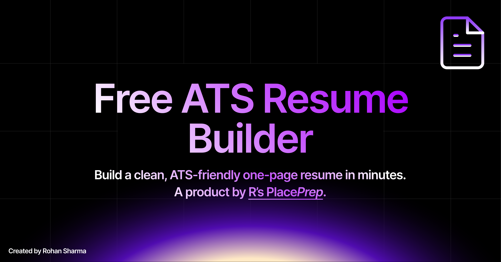

# R's PlacePrep Resume Builder

A free, no-AI, no-signup resume builder. Fill in a form, watch a live A4 preview update in real time, and export a clean, ATS-friendly, text-based one-page PDF. Fully standalone, separate from the main PlacePrep app.

**[Build your resume →](https://resume.placeprep.app)** · **[Read the resume writing guide →](https://resume.placeprep.app/guide/)**

## Why this exists

Most "free" resume builders are template galleries wrapped around a paywall, or export the page as an image that applicant tracking systems can't parse. This one does neither:

- **Text PDFs** — exports selectable, ATS-parsable text via jsPDF, never a screenshot
- **Three ATS-safe templates** — Classic, Modern, Minimal, all strictly black-on-white, single column
- **9+ fonts** — Inter, Aptos, Helvetica, Arial, Source Sans 3, IBM Plex Sans, Roboto, Calibri, Georgia, Times New Roman
- **Live typography controls** — drag or step name size, heading size, body size, meta size and line spacing; the preview auto-fits to one page
- **Zero backend** — everything is saved to your browser's `localStorage`; nothing is ever uploaded
- **A companion guide** — [what a good resume actually looks like](https://resume.placeprep.app/guide/), covering what to put in your summary, experience, and projects, and why quantified bullets beat adjectives

## Stack

- Vite + React + TypeScript
- Tailwind CSS
- jsPDF for text-based (not image) PDF export, so it stays parsable by ATS software
- PostHog for privacy-respecting product analytics, proxied through PlacePrep's own domain
- No backend — all data is saved to `localStorage` in your browser only

## Getting started

```bash
bun install
bun run dev
```

Open the local URL (usually `http://localhost:5173`).

Copy `.env.example` to `.env` if you want analytics enabled locally:

```bash
cp .env.example .env
```

## Build

```bash
bun run build
bun run preview
```

## More from R's PlacePrep

- **[placeprep.app](https://placeprep.app)** — placement-prep and secure online exam platform for universities

## License

MIT © [Rohan Sharma](https://rohansrma.me) — see [LICENSE](LICENSE).

**Built with ❤️ by [Rohan Sharma](https://rohansrma.vercel.app)**

<div align="center">


[⭐ Star](https://github.com/rs-placeprep/placeprep-resume) · [🐛 Issues](https://github.com/rs-placeprep/placeprep-resume/issues) · [🗣️ Discussions](https://github.com/orgs/rs-placeprep/discussions) · [🚀 Try it live](https://resume.placeprep.app)

</div>

**Thank youuuu! 🚀**